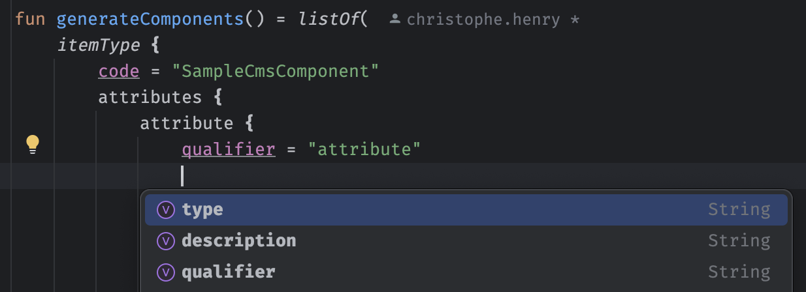

# How to use ?

1. Clone this repository on your local. It is adviced to use the tool in IntelliJ directly to get benefit of auto completion while using the DSL.
2. Open `componentsToAdd.kt` file. It is the only file that needs update.
3. Using the DSL, specify the components to be generated into XML generation
4. Start generation by running command : `./gradlew run`
5. Open the modified file in the IDE and auto format the code (search for `smarteditmodule-items.xml`). Component XML definition is available at the end of the file

*Note: the tool work as long as SAP Commerce project is already present somewhere under HOME folder. First execution will take some time to init everything but is fast after.*

# DSL definition

To generate new components, the DSL follows the XML hierarchy expected by SmartEdit :

```kotlin
fun generateComponents() = listOf( // Inside the list, as many component as needed can be instanciated 
    itemType {
        // isOrdered = false // Uncomment to disable ordering of attributes
        code = "SampleCmsComponent" // The item type identifier
        attributes {
            attribute {
                qualifier = "attribute" // The attribute identifier
                modifiers {
                    optional = true
                }
                persistence {
                    columnType {
                        HYBRIS_LONG_STRING
                    }
                }
            }
            attribute {
                qualifier = "attribute2"
            }
        }
    }
)
```

For any level in the DSL, press `Ctrl or Cmd` + `<space>` to trigger completion and see what are the available properties as shown in following screeshot :



*Note: If ordering of components is not disabled, attributes will be automatically be ordered by beans in SmartEdit in the same order as they have been defined in the DSL.*